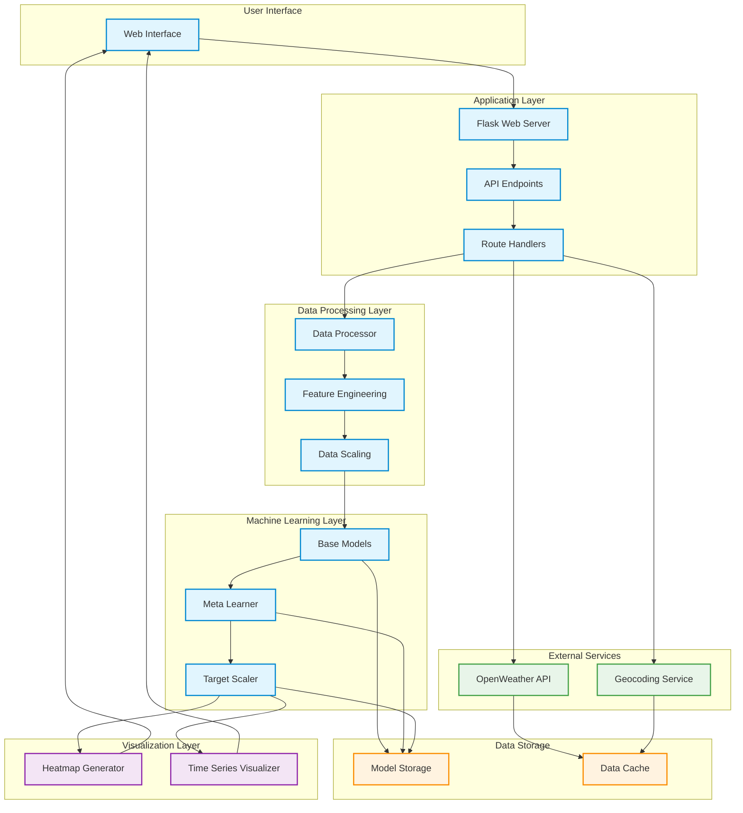

```mermaid
graph TD
    subgraph "User Interface"
        UI[Web Interface]
    end

    subgraph "Application Layer"
        FLASK[Flask Web Server]
        API[API Endpoints]
        ROUTES[Route Handlers]
    end

    subgraph "Data Processing Layer"
        DP[Data Processor]
        FE[Feature Engineering]
        SC[Data Scaling]
    end

    subgraph "Machine Learning Layer"
        BM[Base Models]
        ML[Meta Learner]
        TS[Target Scaler]
    end

    subgraph "External Services"
        OW[OpenWeather API]
        GEO[Geocoding Service]
    end

    subgraph "Data Storage"
        MODELS[Model Storage]
        CACHE[Data Cache]
    end

    subgraph "Visualization Layer"
        HM[Heatmap Generator]
        TSV[Time Series Visualizer]
    end

    %% Connections
    UI --> FLASK
    FLASK --> API
    API --> ROUTES
    ROUTES --> DP
    ROUTES --> OW
    ROUTES --> GEO
    
    DP --> FE
    FE --> SC
    SC --> BM
    BM --> ML
    ML --> TS
    
    OW --> CACHE
    GEO --> CACHE
    
    BM --> MODELS
    ML --> MODELS
    TS --> MODELS
    
    TS --> HM
    TS --> TSV
    
    HM --> UI
    TSV --> UI

    %% Styling
    classDef default fill:#f9f9f9,stroke:#333,stroke-width:2px;
    classDef process fill:#e1f5fe,stroke:#0288d1,stroke-width:2px;
    classDef service fill:#e8f5e9,stroke:#43a047,stroke-width:2px;
    classDef storage fill:#fff3e0,stroke:#fb8c00,stroke-width:2px;
    classDef visualization fill:#f3e5f5,stroke:#8e24aa,stroke-width:2px;
    
    class UI,FLASK,API,ROUTES process;
    class DP,FE,SC process;
    class BM,ML,TS process;
    class OW,GEO service;
    class MODELS,CACHE storage;
    class HM,TSV visualization;
```
