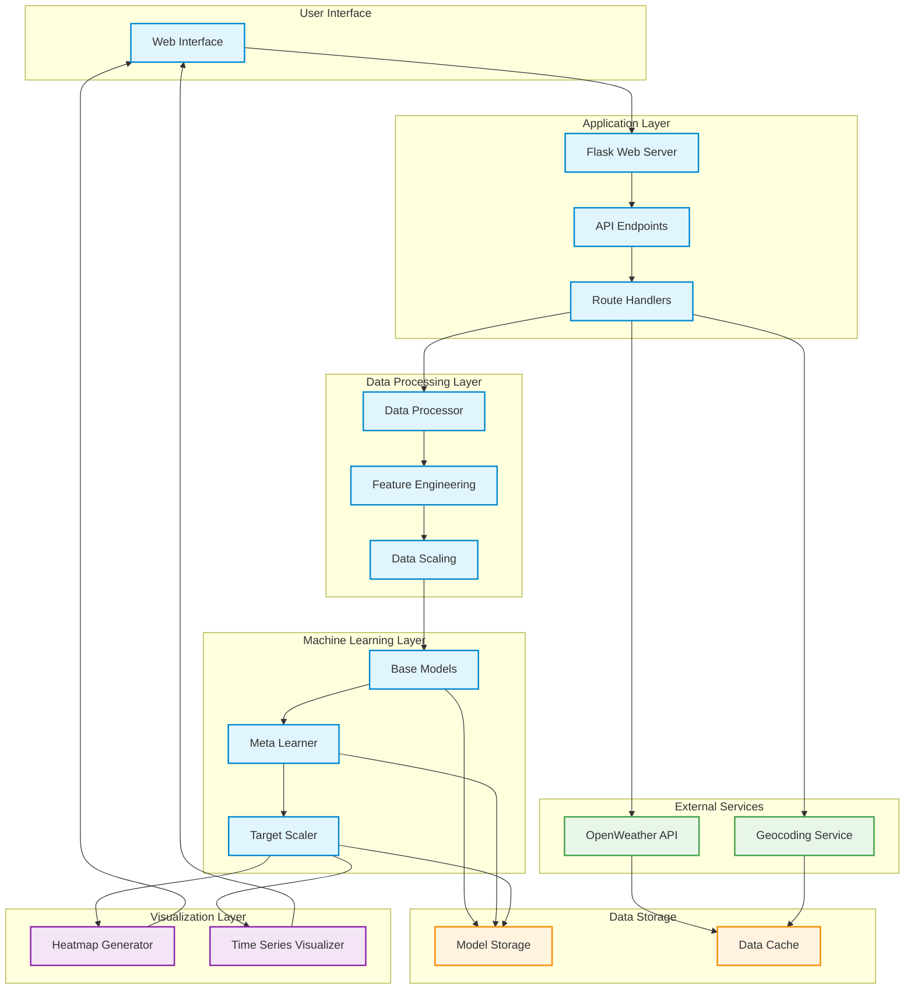

## Architecture Components Description

### 1. User Interface Layer
- **Web Interface**: Modern, responsive UI built with HTML, CSS, and JavaScript
- **Interactive Elements**: City selection, data visualization, real-time updates

### 2. Application Layer
- **Flask Web Server**: Handles HTTP requests and responses
- **API Endpoints**: RESTful endpoints for data access
- **Route Handlers**: Manages application routing and business logic

### 3. Data Processing Layer
- **Data Processor**: Handles data cleaning and preparation
- **Feature Engineering**: Creates model input features
- **Data Scaling**: Normalizes data for model input

### 4. Machine Learning Layer
- **Base Models**: Ensemble of individual prediction models
- **Meta Learner**: Combines base model predictions
- **Target Scaler**: Handles data normalization/denormalization

### 5. External Services
- **OpenWeather API**: Provides weather and pollution data
- **Geocoding Service**: Converts city names to coordinates

### 6. Data Storage
- **Model Storage**: Stores trained ML models
- **Data Cache**: Caches external API responses

### 7. Visualization Layer
- **Heatmap Generator**: Creates NO2 distribution maps
- **Time Series Visualizer**: Generates forecast plots

## Data Flow
1. User selects city through UI
2. Request routed through Flask server
3. External APIs called for data
4. Data processed and features engineered
5. ML models generate predictions
6. Results visualized and returned to UI

## Key Features
- Modular architecture
- Scalable design
- Real-time processing
- Caching for performance
- Error handling at each layer 