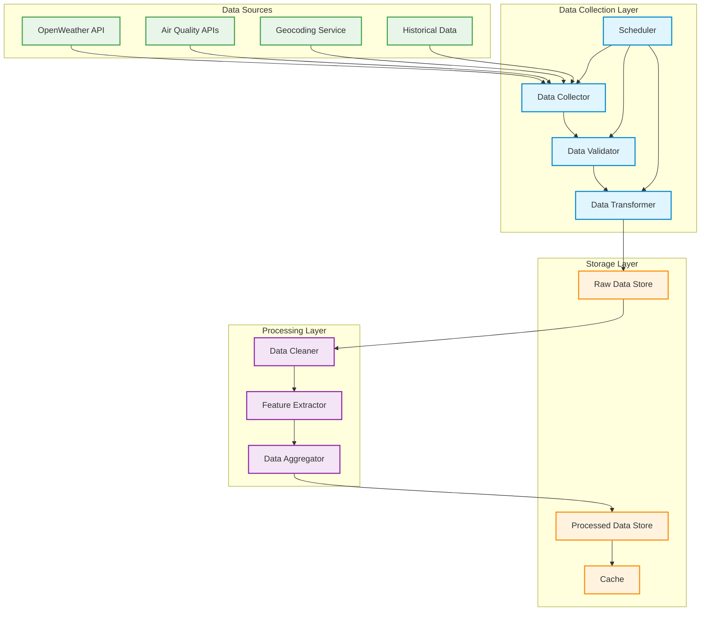

## Data Collection Architecture Description

### 1. Data Sources
- **OpenWeather API**: Real-time weather data
- **Air Quality APIs**: NO2 and other pollutant measurements
- **Geocoding Service**: Location data and coordinates
- **Historical Data**: Past NO2 measurements and weather patterns

### 2. Data Collection Layer
- **Data Collector**: Fetches data from all sources
- **Scheduler**: Manages collection timing and frequency
- **Data Validator**: Ensures data quality and completeness
- **Data Transformer**: Converts data to standard format

### 3. Storage Layer
- **Raw Data Store**: Stores unprocessed data
- **Processed Data Store**: Stores cleaned and processed data
- **Cache**: Temporary storage for frequently accessed data

### 4. Processing Layer
- **Data Cleaner**: Removes anomalies and handles missing values
- **Feature Extractor**: Creates derived features
- **Data Aggregator**: Combines data from multiple sources

## Data Collection Process

1. **Scheduled Collection**
   - Regular intervals (e.g., hourly)
   - Event-triggered collection
   - Manual collection requests

2. **Data Validation**
   - Range checks
   - Format validation
   - Completeness verification
   - Consistency checks

3. **Data Processing**
   - Cleaning and normalization
   - Feature engineering
   - Temporal aggregation
   - Spatial aggregation

4. **Storage Management**
   - Raw data archiving
   - Processed data indexing
   - Cache optimization
   - Data retention policies

## Key Features
- Real-time data collection
- Automated validation
- Error handling and retry mechanisms
- Data versioning
- Backup and recovery
- Monitoring and logging 