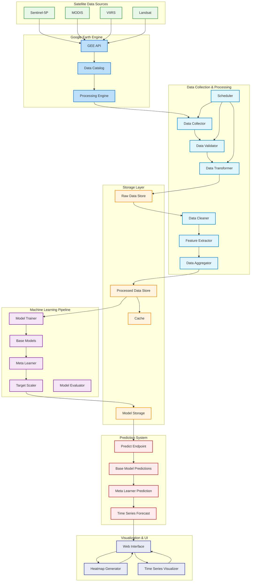

## Prediction System Description

### 1. Prediction Endpoint
- **Predict Endpoint**: Main prediction API
  - Handles city-based requests
  - Integrates weather and pollution data
  - Returns predictions and forecasts

### 2. Prediction Process
- **Base Model Predictions**
  - Multiple model predictions
  - Feature processing
  - Data validation
- **Meta Learner Prediction**
  - Combines base model outputs
  - Applies target scaling
  - Generates final prediction
- **Time Series Forecast**
  - Generates future predictions
  - Creates visualization data
  - Handles prediction bounds

### 3. Integration
- Direct connection to web interface
- Real-time prediction updates
- Interactive visualization
- Error handling and validation

## Prediction Workflow
1. User request through web interface
2. Data collection and validation
3. Base model predictions
4. Meta learner combination
5. Forecast generation
6. Visualization update 