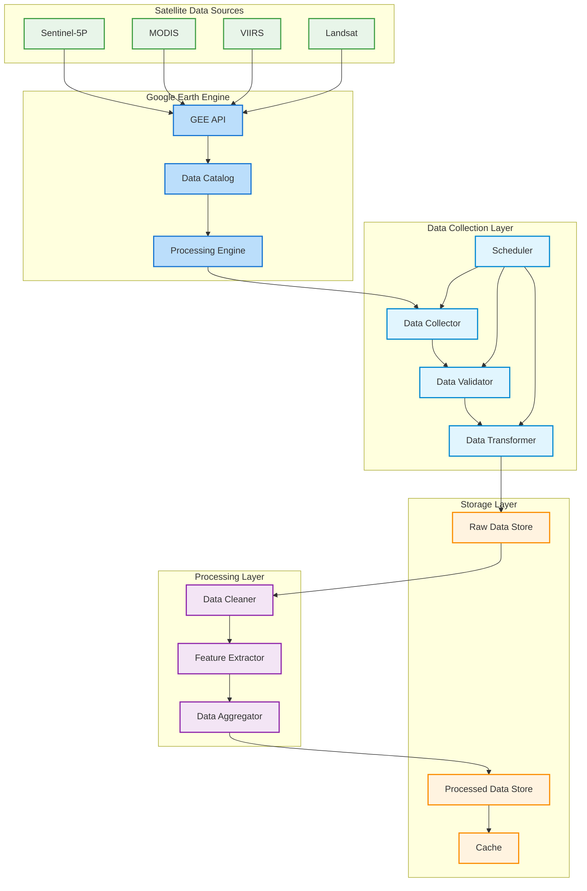

## Satellite Data Collection Architecture Description

### 1. Satellite Data Sources
- **Sentinel-5P**: Primary source for NO2 measurements
  - TROPOMI instrument
  - 7x7 km resolution
  - Daily global coverage
- **MODIS**: Additional atmospheric data
  - Aerosol measurements
  - Cloud cover data
- **VIIRS**: Night-time observations
  - Light pollution data
  - Urban heat island effects
- **Landsat**: Land use and urban data
  - Urban expansion
  - Vegetation indices

### 2. Google Earth Engine Integration
- **GEE API**: Main interface for data access
  - Authentication and authorization
  - API rate limiting
  - Batch processing
- **Data Catalog**: Satellite data repository
  - Historical archives
  - Real-time updates
  - Metadata management
- **Processing Engine**: On-demand computation
  - Image processing
  - Time series analysis
  - Spatial operations

### 3. Data Collection Layer
- **Data Collector**: Fetches satellite data
  - Region of interest selection
  - Time period specification
  - Band selection
- **Scheduler**: Manages collection timing
  - Daily data collection
  - Historical data retrieval
  - Update frequency management
- **Data Validator**: Ensures data quality
  - Cloud cover checks
  - Data completeness
  - Quality flags
- **Data Transformer**: Standardizes data
  - Projection conversion
  - Resolution matching
  - Format standardization

### 4. Storage Layer
- **Raw Data Store**: Original satellite data
  - GeoTIFF format
  - NetCDF format
  - Metadata storage
- **Processed Data Store**: Analyzed data
  - Time series data
  - Aggregated statistics
  - Derived products
- **Cache**: Frequently accessed data
  - Recent observations
  - Common queries
  - Pre-computed results

### 5. Processing Layer
- **Data Cleaner**: Quality control
  - Cloud masking
  - Outlier removal
  - Gap filling
- **Feature Extractor**: Derived metrics
  - NO2 concentration
  - Temporal trends
  - Spatial patterns
- **Data Aggregator**: Data combination
  - Temporal aggregation
  - Spatial aggregation
  - Multi-sensor fusion

## Data Collection Process

1. **Satellite Data Acquisition**
   - Daily data collection from Sentinel-5P
   - Supplementary data from other satellites
   - Historical data retrieval when needed

2. **GEE Processing**
   - Region of interest extraction
   - Cloud masking
   - Atmospheric correction
   - Data quality assessment

3. **Data Processing**
   - NO2 concentration calculation
   - Temporal interpolation
   - Spatial resampling
   - Quality control

4. **Storage and Caching**
   - Raw data archiving
   - Processed data storage
   - Cache management
   - Data versioning

## Key Features
- High-resolution NO2 data
- Global coverage
- Historical data access
- Real-time processing
- Cloud-based computation
- Automated quality control
- Multi-sensor integration 